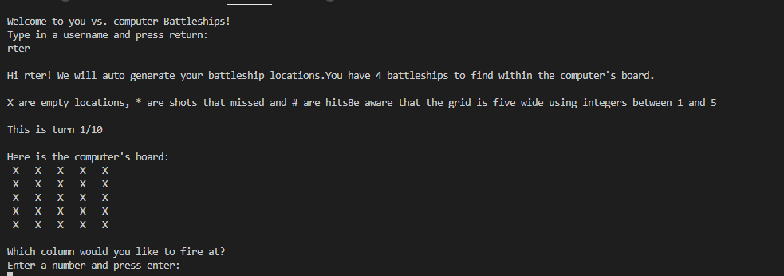

# A Battleships Game
Portfolio Project 3 Python Essentials - Code Institute

# About
This game is of [battleships](http://battleship-game.net/), a well known game originally made on paper after WWI. This version differs from many others in that it is for one user against the computer with randomly generated battleship locations of one square. 

# How To Play

The game will first ask the user to enter a username before randomly generating 4 ship locations on both your board and the computer's board, these are signified with the letter "o". 

The game will then request that the user enters a column and row number (essentially, co-ordinates) of the location they suspect a battleship is laid. If that location is on a battleship, it is a hit and marked as "#". If the location is not on a battleship, it is a miss and marked as "*". 

The computer and user will take ten turns to find all 4 of the ships, should all 10 turns be taken without finding 4 ships, the game will state who has had the most hits and display them as the winner. 

# Features

## Existing Features

- The game is personalised to allow a username to be entered
- The game keeps count of turns and displays this to the user
- The user must press enter to continue to the next turn to allow them to properly see what is happening at each turn
- The game accepts user input for co-ordinates they wish to fire at
- The game is played against the computer

## Future Features

- Use the username throughout the game rather than just in the welcoming statement so that the user can be more personally celebrated or commiserated at the end of the game.
- Allow the user to choose to play against a other (local) player or the computer
- Allow the user to dictate the number of ships and the board size
- Allow the user to position ships themselves
- Allow larger ship sizes than 1x1

# Testinng

## Manual Testing

- When an integer was expected between 1 and 5 
- I tried entering other integers outside of those bounds, the code displayed an error message asked me to try again.
- I tried entering letters, the code displayed an error message and asked me to try again.
- I tried simply pressing return without entering a value, the code displayed an error message and asked me to try again.
- When entering a column and row number, the shot is fired at the correct co-ordinates. This was checked with the numbers (5,4) and (2,3) and displayed as expected
- Checked that the maximum number of turns is ten
- Checked that if the game is won before the ten turns, it will stop the game and display the result. This was tested manually by making the number of # (hits) to win, zero and the game is then immediately won. This was reverted back to 4 after testing.
- Checked that the code to count the number of a character in the board counts the correct amount.
- Checked that there is always four randomly generate battleship locations when a board is generated. 
- Checked that there is no negative impact if the user enters values rather than just pressing enter to continue the game.

## Bugs/Updates after Testing

- After user testing, starting at 0 was a little confusing so the code was updated to accept numbers between 1 and 5 instead.
- After user feedback, I also implemented the input breaks where the user must press enter to continue so that they could see the result of each turn without needing to scroll up.
- There were many commits where I was confused between rows and columns - these have been rectified. 
- If (for some unknown reason) the code was edited for a smaller board containing less than 4 locations, the ship generating function would be stuck in a loop.

## Validator Testing

- Fully passed the [PEP8 online validator](http://pep8online.com/) with the result "All right"

# Deployment
This project was deployed using Code Institute's mock terminal for Heroku.

The steps for deployment are as follows:
- Fork or clone this repository
- Create a new Hiroshima-Wars
- Set the buildpacks to Python and NodeJS in that order
- Link the opoku1968 to the repository
- Click on Deploy

# Credits

- This project uses the [Code Institute student template](https://github.com/Code-Institute-Org/python-essentials-template) for deploying the third portfolio project, the Python command-line project.
- The idea of using battleships is a suggested one by the Code Institute with "Ultimate Battleships" as inspiration.
- Thank you to my son, Francis Nyame, for providing user feedback.

