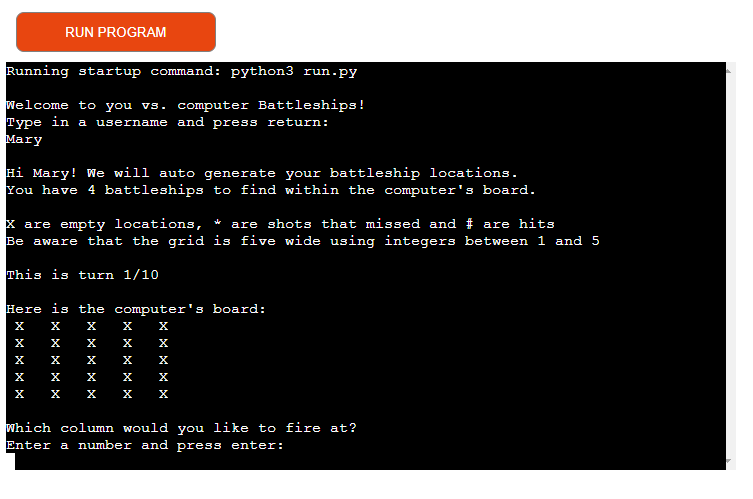

# Battleship Game

The Battleship game is a classic two-player strategy game where each player hides a fleet of ships on a grid and attempts to sink the opponent's ships by making guesses. In this Python implementation, the player competes against the computer in finding and sinking each other's battleships.
The deployed project live link is [HERE](#) - 
***Use Ctrl (Cmd) and click to open in a new window.*** 

# Contents

- [Introduction](#introduction)
- [Project](#project)
  - [User goals:](#user-goals)
  - [Game owner goals](#game-owner-goals)
- [Development](#development)
- [Features](#features)
  - [Game Initialization](#game-initialization)
  - [Game Boards](#game-boards)
  - [User Input](#user-input)
  - [Hit and Miss Feedback](#hit-and-miss-feedback)
  - [Outcome Declaration](#Outcome-declaration)
  - [Error Handling](#error-handling) 
- [Technologies Used](#technologies-used)
  - [Resources](#resources)
- [Testing](#testing)
  - [Manual Testing](#manual-testing)
- [Validator Testing](#validator-testing)
- [Deployment](#deployment)
- [Bugs/Updates after Testing](#bugs-updates-after-testing)
- [Credits](#credits)
- [Acknowledgements](#acknowledgements)

# Introduction
This game is  a Python implementation of [Battleships](http://battleship-game.net/), a well-known game originally played on paper after WWI. This version is designed for one user to compete against the computer with randomly generated battleship locations, each consisting of a single square.

## Project 

The aim of this project is to:

- The primary goal is to locate and sink all of the opponent's battleships before the opponent can sink yours.
- Players must strategically guess the coordinates on the opponent's game board where their battleships might be hidden.
- The game is played over a maximum of ten turns for each player, creating a sense of urgency and strategy.
- The game provides immediate feedback on each guess, indicating whether the guess was a hit or a miss.*
- While attempting to sink the opponent's ships, players must also protect their own ships from being hit by the opponent
- Players need to make informed decisions about where to target their shots, considering the information gained from previous guesses.
-The game ends when one player successfully sinks all four of the opponent's battleships or after ten turns, whichever comes first.
- The player who sinks all opponent battleships first is declared the winner.
- In case neither player sinks all ships within ten turns, the game declares the winner based on the number of hits.
- The game aims to provide an engaging and entertaining experience, challenging players to outsmart their computer opponent.

### User goals:
In playing the Battleship game, users aim to strategically outmaneuver the computer by sinking its battleships while safeguarding their own fleet. The overarching goal is to achieve victory by skillfully making informed guesses, capitalizing on limited turns to maximize hits, and enjoying an interactive and engaging gaming experience. Users seek immediate feedback on their decisions, find satisfaction in successfully sinking opponent battleships, and enjoy the challenge of tactical thinking. Ultimately, the user's goal is to experience a sense of accomplishment through strategic gameplay and emerge as the victor in this competitive and enjoyable gaming environment.

### Game owner goals
The game owner's goals for the Battleship game encompass fostering user engagement, maximizing monetization opportunities through in-game purchases and advertisements, ensuring a positive and enjoyable user experience to retain a loyal player base, building and nurturing a community around the game, promoting the brand through the game's success, implementing continuous improvements based on player feedback and industry trends, adapting to market dynamics, conducting thorough data analysis for informed decision-making, and ensuring legal and ethical compliance. By achieving these objectives, the game owner aims to establish a successful and sustainable game that resonates with players, enhances the brand's visibility, and contributes to the overall growth and longevity of the gaming platform.

## Development
The code for the Battleship game demonstrates effective development practices by employing modular design, clear function definitions, and logical structuring. The use of functions like 'make_board', 'print_board', and others enhances code readability and promotes reusability, allowing for easy modification and extension. 

[image of Username Input](Username.png)

The implementation of user input validation in the 'validate_data' function showcases a commitment to robust error handling, ensuring the program gracefully handles unexpected inputs. Additionally, the game design reflects an understanding of the classic Battleship mechanics, providing users with a familiar yet engaging experience. The use of comments throughout the code further aids in comprehensibility, guiding developers and collaborators through the logic and functionality. This code development approach facilitates maintainability, ease of debugging, and potential future enhancements, contributing to the overall effectiveness of the Battleship game implementation.

[image of validated username Input](validated-username.png)

### Game Initialization
The game starts by welcoming the player, prompting them to enter a username.

[image of Username Input](Username.png)

### Game Boards
Three separate game boards are created for the user, computer, and user's guesses.
The user and computer boards are initialized with battleships placed randomly.

[image of Game Boards](gameboard.png)

### User Input
Users enter their guesses for the row and column coordinates to locate and hit the computer's battleships.

[image of User Input](guessrowncol.png)

### Hit and Miss Feedback  
Players receive immediate feedback on whether their guess was a hit or a miss

[image of Hit and Miss Feedback](feedback.png)

### Outcome Declaration

The 'check_winner_final' function declares the winner and displays the game outcome.

[image of Hit and Miss Feedback](outcome.png)

### Error Handling

The code incorporates error handling mechanisms, such as validating user input, to ensure a smooth and error-free gaming experience.

[image of Hit and Miss Feedback](error.png)

## Technologies Used

The main technology used to create this program is Python

### Resources

- Codeanywhere 
- Visual Studio Code (VSC)
- GitHub 

# Testing
The portal has been well tested.

## Manual Testing

- When an integer was expected between 1 and 5 
- I tried entering other integers outside of those bounds, the code displayed an error message asked me to try again.
- I tried entering letters, the code displayed an error message and asked me to try again.
- I tried simply pressing return without entering a value, the code displayed an error message and asked me to try again.
- When entering a column and row number, the shot is fired at the correct co-ordinates. This was checked with the numbers (5,4) and (2,3) and displayed as expected.
- Checked that the maximum number of turns is ten.
- Checked that if the game is won before the ten turns, it will stop the game and display the result. This was tested manually by making the number of # (hits) to win, zero and the game is then immediately won. This was reverted back to 4 after testing.
- Checked that the code to count the number of a character in the board counts the correct amount.
- Checked that there is always four randomly generated battleship locations when a board is generated. 
- Checked that there is no negative impact if the user enters values rather than just pressing enter to continue the game.

## Bugs/Updates after Testing

- After user testing, starting at 0 was a little confusing, so the code was updated to accept numbers between 1 and 5 instead.
- After user feedback, I also implemented the input breaks where the user must press enter to continue so that they could see the result of each turn without needing to scroll up.
- There were many commits where I was confused between rows and columns - these have been rectified. 
- If (for some unknown reason) the code was edited for a smaller board containing fewer than 4 locations, the ship generating function would be stuck in a loop.

## Validator Testing

- Fully passed the [PEP8 online validator](http://pep8online.com/) with the result "All right"

# Deployment
This project was deployed using Code Institute's mock terminal for Heroku.

The steps for deployment are as follows:
- Fork or clone this repository.
- Create a new Heroku app.
- Set the buildpacks to Python and NodeJS in that order.
- Link the app to the repository.
- Click on Deploy.

## Credits

- Learn Pythin with CodeCademy Battleship helped me get my project started - [here](https://www.youtube.com/watch?v=7Ki_2gr0rsE)

- W3 schools also aided me with the understanding of some of the functions [here](https://www.w3schools.com/python/)

- This project uses the [Code Institute student template](https://github.com/Code-Institute-Org/python-essentials-template) for deploying the third portfolio project, the Python command-line project.

- The idea of using Battleships is a suggested one by the Code Institute with "Ultimate Battleships" as inspiration.

- Thank you to Francis Nyame [here](https://www.linkedin.com/in/nyame-francis-sarkodie-431909146/)

## Acknowledgements

Xysco Technologies group for their support during huddles and when reviewing my code.

